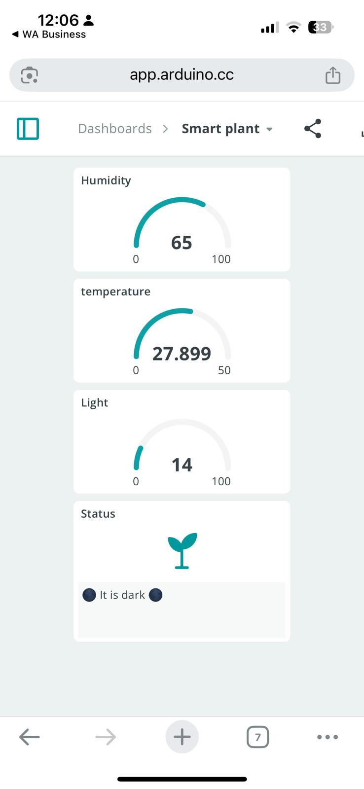
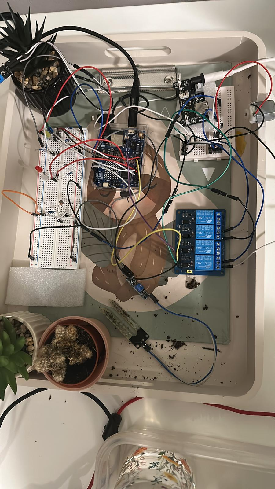
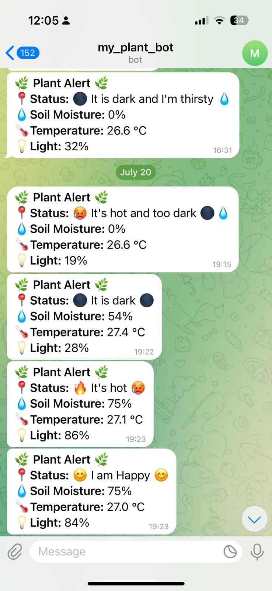

# 🌱 Smart Plant Monitoring and Control System

This is an IoT-based system designed to automatically monitor and care for a plant using sensors and actuators. Built with an Arduino UNO R4 WiFi board, it checks temperature, soil moisture, and ambient light, then responds with watering, cooling, and user alerts.

---

## 🔧 Features

- Real-time monitoring of temperature, soil moisture, and light
- Automatic watering when the soil is dry
- Fan activation when temperature is too high
- Status indication using LEDs
- Cloud dashboard via Arduino Cloud
- Telegram bot alerts

---

## 📦 Components

| No. | Component                     | Model/Type                        | Notes                                 |
|-----|-------------------------------|-----------------------------------|---------------------------------------|
| 1   | Power Supply Module           | MB102                              | 6.5V–9V input, 3.3V/5V output         |
| 2   | Microcontroller               | Arduino UNO R4 WiFi (ESP32-S3)     | WiFi-enabled board                    |
| 3   | Relay Module                  | Songle SRD-05VDC-SL-C (4-Channel)  | Controls fan and water pump          |
| 4   | Soil Moisture Sensor          | YL-69 + YL-38                      | Analog output                         |
| 5   | Temp & Humidity Sensor        | DHT11                              | Digital output                        |
| 6   | Light Sensor                  | LDR (GL5528) + 10kΩ pull-down      | Analog output                         |
| 7   | Fan Motor                     | Generic 3V–6V DC Motor             | Controlled via relay                 |
| 8   | Mini Water Pump               | 3V–6V Submersible                  | Controlled via relay                 |
| 9   | LEDs                          | Red, Green, Yellow, White          | With 220Ω resistors                  |
| 10  | Resistors                     | 220Ω & 10kΩ                        | For LEDs and sensors                 |
| 11  | Breadboard & Jumper Wires    | –                                  | For prototyping                      |

---

## 🔌 Pin Mapping

| Pin | Component               | Type     | Description                       |
|-----|-------------------------|----------|-----------------------------------|
| A0  | Soil Moisture Sensor    | Analog In| Reads soil moisture level         |
| A1  | Light Sensor (LDR)      | Analog In| Reads ambient light               |
| D2  | DHT11                   | Digital In| Reads temperature & humidity     |
| D3  | Cold Indicator LED      | Output   | Turns ON when temperature is low |
| D4  | Warm Indicator LED      | Output   | Turns ON when temperature is high|
| D5  | Fan Relay               | Output   | LOW = Fan ON                      |
| D6  | Light Warning LED       | Output   | Indicates insufficient light      |
| D7  | Thirsty Plant LED       | Output   | ON when soil is dry               |
| D8  | Water Pump Relay        | Output   | LOW = Pump ON                     |
| D9  | Happy Plant LED         | Output   | ON when all conditions are good   |

---

## 🧠 How It Works

1. System connects to WiFi and the Arduino Cloud.
2. Sends a startup message to the user's Telegram.
3. Monitors sensors every second:
   - If soil is dry → turns on pump for 30 sec.
   - If temperature is high → turns on fan for 30 sec, waits 5 mins.
   - Updates LEDs based on conditions.
4. Sends alerts to Telegram when plant status changes.
5. User can monitor all data via the Arduino Cloud dashboard.

---

## 🌐 Cloud and Communication

- **Platform:** Arduino Cloud
- **WiFi:** Built-in ESP32-S3 on Arduino UNO R4
- **Dashboard:** Live visualization of temperature, light, and soil moisture
- **Messaging:** Telegram Bot API for real-time alerts

---

## 🎯 Goals and Applications

- Smart irrigation for homes, classrooms, greenhouses
- Educational tool for IoT and automation
- Scalable for larger plant monitoring systems

---

## 🧪 Future Improvements

- Add mobile app notifications
- Expand to multiple plant zones
- Solar-powered version
- Add water level sensing

---

## 📜 License

This project is open-source under the MIT License. Feel free to use, modify, and share with credit.

---

## 📷 Preview

